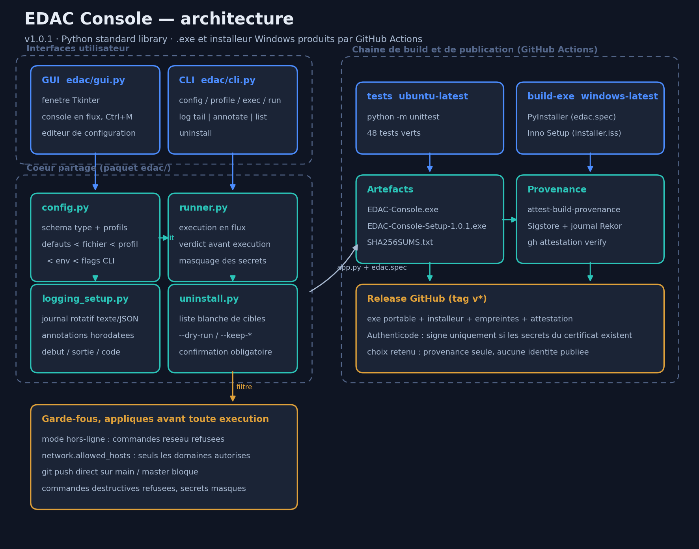

# Expert Dev Autopilot — Console (.exe + .bat)

Application **fenetree Windows** (Tkinter, aucune dependance externe) qui pilote
l'agent `expert-dev-autopilot` : actions de build et de packaging, module de
configuration complet, journal en flux. Utilisable aussi en ligne de commande
et sous Linux/macOS.

Documentation : [`docs/RESUME.md`](docs/RESUME.md) (resume commente : choix
techniques, chaine de build, mecanismes de confiance) et le schema
d'architecture ci-dessous, regenerable par
`python tools/make_architecture_diagram.py`.



## Demarrage rapide (Windows)

```bat
setup.bat        :: verifie Python 3.10+, cree .venv, installe PyInstaller
run.bat          :: ouvre la fenetre (sans console noire)
build-exe.bat    :: produit dist\EDAC-Console.exe + taille + SHA-256
```

Linux / macOS : `./run.sh` (necessite `python3-tk`).

## Fenetre

| Onglet | Contenu |
| --- | --- |
| Tableau de bord | 11 actions (setup, dev, lint, test, build, package .exe/.apk/.dmg, verify, clean, doctor), commande personnalisee, bouton Stop, chaine autopilot complete |
| Configuration | formulaire genere depuis le schema, 6 sections, profils, appliquer/enregistrer/recharger/defauts/exporter/importer |
| Journal | sortie en flux, coloree par niveau, secrets masques, export `.log` |
| A propos | chemin de config, plateforme, rappel des garde-fous |

Raccourcis : `Ctrl+S` enregistrer · `Ctrl+L` vider le journal · `Echap` stopper
la commande en cours.

## Module de configuration

Priorite croissante :

```
defauts  <  fichier  <  profil actif  <  variables EDAC_*  <  --set cle=valeur
```

- Fichier : `%APPDATA%\ExpertDevAutopilot\config.json` (Windows),
  `~/.config/ExpertDevAutopilot/config.json` (Linux),
  `~/Library/Application Support/...` (macOS). Ecriture atomique + `.bak`.
- 30 reglages types (`bool`, `int`, `choice`, `path`, `list`) valides et
  convertis a la lecture comme a l'ecriture ; les cles inconnues d'anciennes
  versions sont signalees, pas fatales.
- Profils nommes (`default`, `ci`, `perso`, …) avec heritage des valeurs
  globales.
- Chaque cle a une variable d'environnement dediee : `project.stack` →
  `EDAC_PROJECT_STACK`.

### CLI

```bash
python -m edac config list        # valeurs effectives + origine (cli/env/profile/file/default)
python -m edac config schema      # schema JSON complet
python -m edac config set build.default_target apk
python -m edac profile create ci --copy
python -m edac --set ui.theme=sombre run build
python -m edac exec "npm run lint"
python -m edac doctor
```

Sous Windows, `run.bat` accepte les memes arguments : `run.bat config list`.

## Journal avec commentaires

Chaque commande est encadree dans un fichier de log rotatif par une annotation
horadatee (`# 22:31:07 [agent] debut : npm run build`), et vous pouvez inserer
vos propres commentaires depuis la fenetre (onglet **Journal**, champ
« Commentaire », `Ctrl+M`) ou en ligne de commande.

```bash
python -m edac log path                       # emplacement du fichier
python -m edac log tail -n 100                # dernieres lignes
python -m edac log annotate "on teste le build signe"
python -m edac log list                       # fichiers de rotation
python -m edac log clear --yes                # purge
```

Emplacement par defaut : `%LOCALAPPDATA%\ExpertDevAutopilot\logs\` (Windows),
`~/.local/state/ExpertDevAutopilot/logs/` (Linux),
`~/Library/Logs/ExpertDevAutopilot/` (macOS).

Section **Journalisation** de la configuration : niveau (`DEBUG`…`ERROR`),
format `texte` ou `json` (une ligne JSON par evenement), taille max par
fichier, nombre de fichiers de rotation, sortie console, journalisation de la
sortie des commandes, annotation automatique.

## Options reseau

Section **Reseau** : mode hors-ligne, proxy HTTP/HTTPS, `NO_PROXY`, timeout,
nombre de tentatives, registre npm, index pip, hotes autorises, verification
TLS. Les valeurs sont exportees vers les commandes enfants (`HTTP_PROXY`,
`HTTPS_PROXY`, `NO_PROXY`, `NPM_CONFIG_REGISTRY`, `PIP_INDEX_URL`,
`EDAC_NETWORK_TIMEOUT`, `EDAC_NETWORK_RETRIES`).

```bash
python -m edac config set network.http_proxy http://proxy.interne:3128
python -m edac config set network.allowed_hosts registry.npmjs.org,github.com
python -m edac --set network.offline=true run build
```

En mode hors-ligne, une commande reseau (`npm install`, `git clone`, `curl`,
toute URL) est refusee avant execution. Si `network.allowed_hosts` est non
vide, seules les URL de ces domaines passent.

## Desinstallation

```bat
uninstall.bat --dry-run          :: plan detaille, rien n'est supprime
uninstall.bat --keep-config      :: garde la configuration
uninstall.bat --yes              :: sans confirmation
```

```bash
./uninstall.sh --dry-run
python -m edac uninstall --keep-logs
```

Sont retires : `.venv`, `build`, `dist`, `release`, les caches `__pycache__`,
le fichier et le dossier de configuration, les journaux et leurs rotations,
et les raccourcis bureau / menu Demarrer. Le dossier source du projet n'est
jamais supprime, et une confirmation est demandee sauf avec `--yes`. Si
l'application a ete installee via `EDAC-Console-Setup.exe`, desinstallez-la
aussi depuis *Parametres > Applications*.

## Garde-fous

`Securite > Commandes bloquees` refuse toute commande contenant un motif
interdit (`rm -rf /`, `git push --force origin main`, `DROP DATABASE`,
`format c:`), y compris quand « Allow all » est actif. Les valeurs qui
ressemblent a des secrets (`token=`, `password=`, `keystore=`) sont masquees
dans le journal. Un `git push` vers `main`/`master` est refuse tant que
`git.push_protected` reste desactive.

## Construction du .exe et de l'installeur

Deux artefacts, comme un logiciel Windows classique :

| Artefact | Contenu |
| --- | --- |
| `dist\EDAC-Console.exe` | version portable, un seul fichier, icone et proprietes de version (Produit, Version, Editeur) |
| `release\EDAC-Console-Setup-<version>.exe` | installeur : assistant FR/EN, licence, dossier au choix, Menu Demarrer, raccourci Bureau, PATH utilisateur optionnel, entree *Applications* et desinstalleur Windows |

```bat
build-exe.bat            :: icone + exe + installeur (si Inno Setup 6 est installe) + SHA-256
iscc /DAppVersion=1.0.1 installer.iss   :: installeur seul
```

L'icone `assets/icon.ico` est regeneree par `python tools/make_icon.py`
(Pillow, 7 resolutions de 16 a 256 px) et la ressource de version est derivee
de `edac.__version__` par `tools/win_version.py` : une seule source de verite
entre le code, l'`.exe` et l'installeur.

## Signature Authenticode

Sans signature, Windows SmartScreen affiche « editeur inconnu ». La signature
est optionnelle : le certificat n'est jamais versionne et les etapes de CI sont
ignorees tant que les secrets sont absents.

1. Obtenir un certificat de signature de code (OV ou EV) aupres d'une autorite
   (DigiCert, Sectigo, SSL.com...). Un certificat auto-signe ne supprime pas
   l'avertissement SmartScreen : il ne sert qu'aux tests internes.
2. Convertir le `.pfx` en base64 :

```powershell
[Convert]::ToBase64String([IO.File]::ReadAllBytes("cert.pfx")) | Set-Clipboard
```

3. Dans GitHub : *Settings -> Secrets and variables -> Actions -> New repository
   secret* : `WINDOWS_CERT_PFX_BASE64` (le base64) et `WINDOWS_CERT_PASSWORD`
   (le mot de passe du `.pfx`).
4. Relancer le workflow : `tools/sign_windows.ps1` signe et horodate l'`.exe`
   puis l'installeur, verifie chaque signature et efface le `.pfx` temporaire.

### Provenance (gratuit)

Chaque build attache une attestation de provenance GitHub aux deux `.exe`
(gratuite sur les depots publics). Elle ne supprime pas l'alerte SmartScreen
mais prouve que le binaire vient bien de ce depot et de ce workflow :

```bash
gh attestation verify EDAC-Console.exe --repo safe-green-Agent-anonymouse/AgentCRSSPLTFRM_Ai-vscode_free
```

La provenance est le mode de verification retenu par le projet : elle n'expose
aucune donnee personnelle, contrairement a un certificat Authenticode dont le
nom du titulaire est publie dans chaque binaire. Details et alternatives dans
`SIGNING.md`.

Signature manuelle en local :

```bat
signtool sign /fd SHA256 /tr http://timestamp.digicert.com /td SHA256 /f cert.pfx dist\EDAC-Console.exe
```

## Publication

Le workflow `.github/workflows/windows-exe.yml` execute les tests sur Ubuntu,
puis sur `windows-latest` : icone, `.exe`, installeur Inno Setup, verification
de demarrage de l'executable, `SHA256SUMS.txt`, artefact telechargeable. Un tag
`v*` publie en plus une release GitHub avec les deux `.exe` et les empreintes :

```bash
git tag v1.0.1 && git push origin v1.0.1
```

## Tests

```bash
python -m unittest discover -s tests -v   # 42 tests : config, profils, garde-fous, journaux, reseau, desinstallation, packaging
```

## Contact

Questions, bugs, securite : iSafe_User002@proton.me, ou une issue GitHub.

## Limite verifiee

Le `.exe` ne peut pas etre produit sur Linux : PyInstaller ne fait pas de
compilation croisee. Utilisez `build-exe.bat` sur Windows ou le job CI
`windows-latest`. Le code Python, la CLI et la fenetre ont ete executes et
valides sous Linux.
